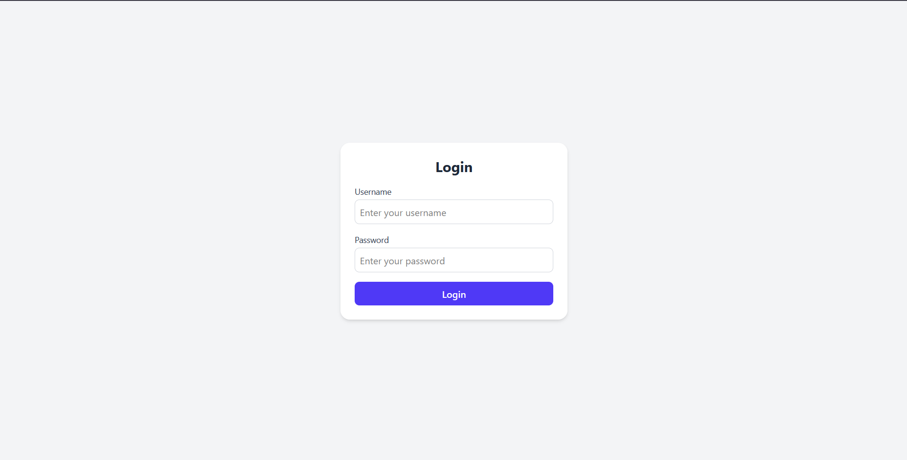
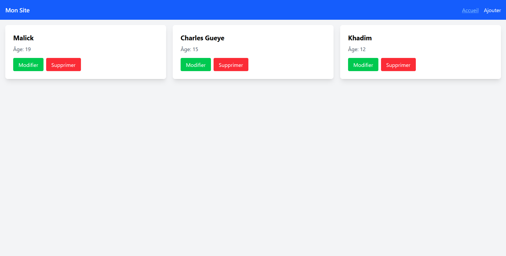
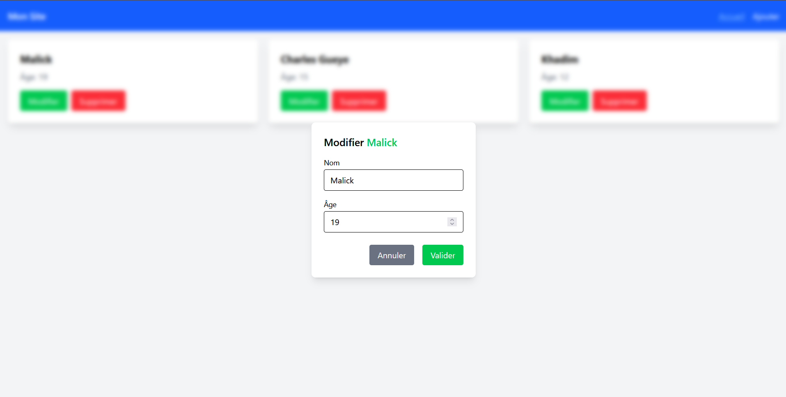
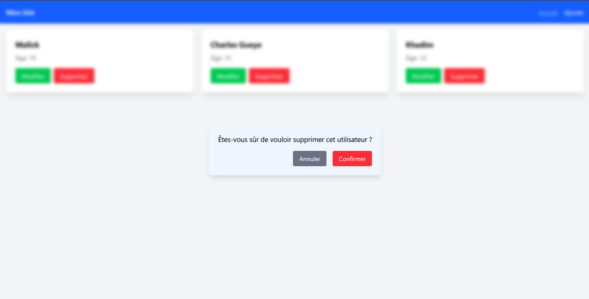
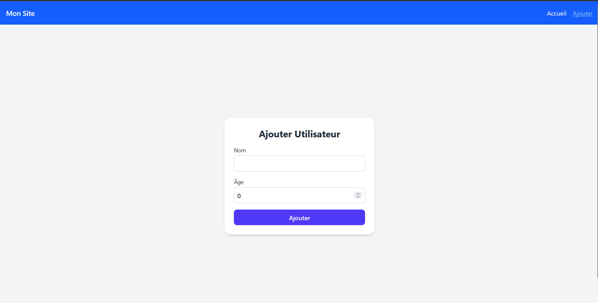

# Teste Edacy Frontend

# NB : pour la connection utilisons les identifiants 
   ## Login : Malick
   ## Mot de passe : 1805

j'ai codé ce teste avec react + vite + ts

## la page de connection 

## la page d'accueil

## popup de modification

## popup de suppression

## la page d'ajout

